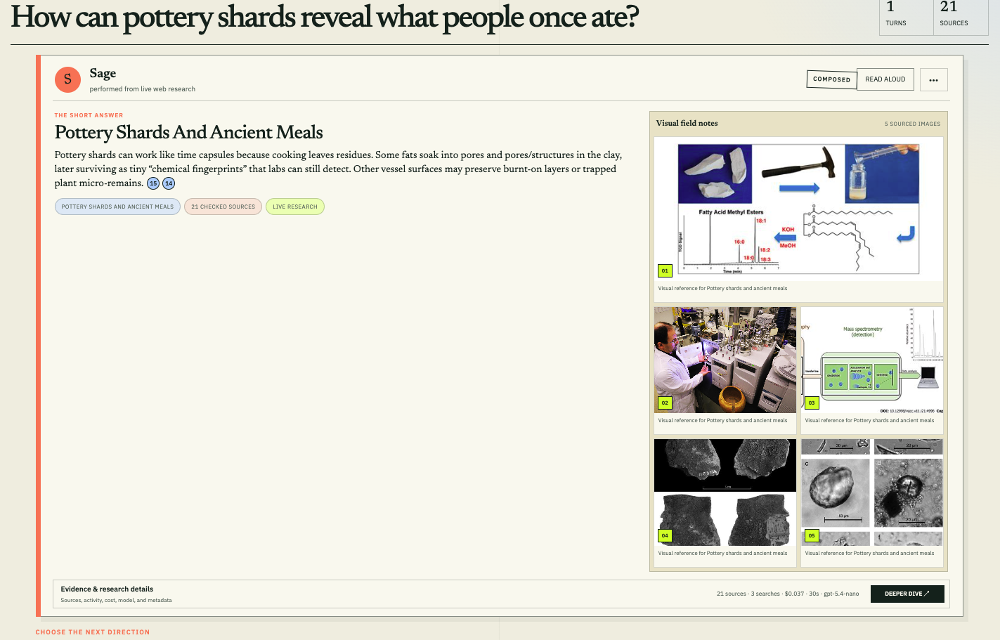
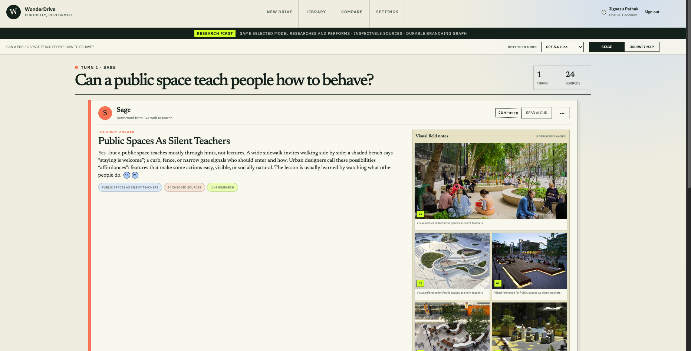

# WonderDrive answer + visual evidence audit

Date: 2026-07-14

## Audit scope

This audit reviews the current answer card and its multi-image “Visual field notes” surface using the two supplied desktop screenshots and the implementation in `app/wonderdrive-experience.tsx`, `app/globals.css`, `lib/contracts.ts`, and `lib/live-research.ts`.

User goal: read a concise answer, understand why every image was selected, inspect images at a useful size, and move between images without losing the answer or source context.

## Step 1 — Pottery answer



Health: **Needs attention**.

Five images are visible and the lead-image hierarchy is understandable. However, the gallery is much taller than the short answer, leaving most of the left column empty. The captions repeat a generic topic label rather than explaining the distinctive value of each image. Scientific diagrams are also shown with `object-fit: cover`, which can crop labels or axes that carry the evidence.

## Step 2 — Public-space answer



Health: **Needs attention**.

The eight-image case makes the structural problem more obvious: the contact sheet extends beyond the viewport, the next-direction controls are pushed down, and the user has no clear reason to inspect image 2 rather than image 7. The images are individually clickable, but the current implementation opens the source page instead of selecting a larger in-context view.

## What already works

- The sourced-image count and numbered images communicate that the gallery is evidence, not decoration.
- The first image is visually prioritized.
- `<figure>`, `<figcaption>`, meaningful `alt`, and source links provide a reasonable semantic starting point.
- The visual language already fits WonderDrive: paper tones, hard borders, compact editorial labels, acid/coral accents, and visible provenance.

## Highest-impact problems

1. **The layout encodes the wrong relationship.** A short answer and an arbitrarily tall contact sheet share one grid row, so the tallest column determines the card height and creates the dead area.
2. **Every image has nearly the same explanation.** `TurnMedia` only contains `caption`, `alt`, image URLs, and a source-page URL. The fallback caption is literally “Visual reference for {topic}.” The missing information is upstream, not just hidden by CSS.
3. **Click means “leave,” not “inspect.”** A thumbnail link opens the external source. There is no selected image, local next/previous navigation, zoomed view, or persistent explanation.
4. **The presentation can damage evidence.** `object-fit: cover` is acceptable for photo thumbnails but risky for charts, diagrams, microscopy, and screenshots because it can remove labels or scale bars.
5. **The gallery competes with the curiosity loop.** At 5–8 images it pushes “Choose the next direction” below the fold even though that is the product’s primary continuation action.
6. **Image relevance and evidentiary strength are conflated.** A photograph may illustrate context while a diagram may explain a method; neither automatically proves the answer’s claim. The UI currently calls all of them “visual references” without stating their role.

## Recommended design: Evidence Focus Viewer

Replace the contact sheet with a master-detail viewer inside the existing answer card.

### Desktop composition

```text
┌ Performer / composed / read aloud ───────────────────────────────┐
│ ┌───────────────────────────┐  ┌───────────────────────────────┐ │
│ │                           │  │ THE SHORT ANSWER              │ │
│ │   selected image, large   │  │ answer copy + citations      │ │
│ │   contain, not cropped    │  │ tags                          │ │
│ │                           │  │ ───────────────────────────── │ │
│ │  01 of 08   Expand        │  │ IMAGE 01 · PROCESS           │ │
│ └───────────────────────────┘  │ Why it is here                │ │
│                                │ What to notice                 │ │
│                                │ What it helps you understand   │ │
│                                │ Caveat / relation to claim     │ │
│                                │ Source, credit, license ↗      │ │
│                                └───────────────────────────────┘ │
│ [01 selected] [02] [03] [04] [05] [06] [07] [08]  ← →           │
├ Evidence & research details ─────────────────────────────────────┤
└──────────────────────────────────────────────────────────────────┘
```

Recommended proportions at the current maximum card width:

- 58–62% for the selected image stage.
- 38–42% for the combined short answer and selected-image explanation.
- A 92–112 px thumbnail rail spanning the card width.
- A stable viewer height of roughly 430–520 px, so 5 and 8 image answers occupy nearly the same space.

On mobile, reorder to: short answer → selected image → image explanation → horizontal thumbnail rail. Do not preserve the current compressed two-column answer/gallery layout below 500 px.

### Information attached to every image

Use concise, distinct fields:

- **Title:** a specific name, not the answer topic.
- **Role:** `Object`, `Process`, `Result`, `Context`, `Comparison`, `Scale`, or `Primary source`.
- **Why it is here:** one sentence linking the image to the answer.
- **What to notice:** 1–3 concrete visible observations.
- **What it helps explain:** the takeaway the learner should carry back to the answer.
- **Evidence relationship:** `Shows directly`, `Illustrates`, `Provides context`, or `Supports with source`. This prevents an illustrative photograph from appearing to prove a scientific claim.
- **Caveat:** optional, but important for reconstructions, stock images, composites, diagrams, or indirect examples.
- **Provenance:** publisher/creator, source page, license/rights when available, and the answer citation(s) connected to the interpretation.
- **Accessible description:** short alt text for simple images; a visible expandable long description for charts, diagrams, and other complex images.

Example for the pottery chromatography image:

> **Process · Residue extraction and chromatography**
>
> **Why it is here:** It shows the laboratory steps behind the claim that absorbed fats can survive in pottery.
>
> **What to notice:** A shard is sampled, compounds are extracted, and peaks are compared by retention time.
>
> **What it helps explain:** Researchers do not identify an ancient meal by eye; they infer ingredients from chemical signatures and comparison samples.
>
> **Relationship:** Illustrates the analytical method; the linked study supports the historical interpretation.

## Interaction specification

- Make each thumbnail a `<button>` that selects an image. Keep “Open original source” as a separate link in the detail panel.
- Show a persistent selected state, “Image n of total,” and previous/next controls. Support Left/Right Arrow keys while the viewer is focused.
- Do not auto-advance. W3C notes that carousel content can be hard to discover, and any movement must be controllable and announced.
- Clicking the large image or “Expand” opens a true modal viewer. `Escape` closes it, focus stays inside while open, and focus returns to the invoking control.
- In the modal, use the original image with `object-fit: contain`; add zoom only where the source resolution supports it.
- Announce selection changes through a polite live region, but do not move keyboard focus on every thumbnail selection.
- Keep thumbnail/control targets at least 24×24 CSS px; 44×44 is the more comfortable touch target.
- Preserve the selected image when the user opens and closes research details.
- Use skeletons and reserve aspect-ratio space to avoid layout shift. A failed image should remain as a labeled unavailable item rather than silently changing the total count.

## Data and implementation implications

The current `TurnMedia` contract is too small. A useful next shape is:

```ts
type TurnMedia = {
  id: string;
  imageUrl: string;
  thumbnailUrl?: string;
  sourcePageUrl: string;
  title: string;
  role: "object" | "process" | "result" | "context" | "comparison" | "scale" | "primary-source";
  whyIncluded: string;
  observations: string[];
  learning: string;
  evidenceRelation: "shows" | "illustrates" | "contextualizes" | "supports";
  caveat?: string;
  alt: string;
  longDescription?: string;
  publisher?: string;
  creator?: string;
  license?: string;
  sourceIds: string[];
};
```

Do not fabricate these fields from the current generic caption. A safer pipeline is:

1. Retrieve and deduplicate candidate images.
2. Rank for relevance and diversity of role; prefer 3–5 strong images by default, with “Show all” for more.
3. Inspect the actual selected image and its source context in a structured visual-annotation pass.
4. Generate observations that are limited to visible content, and generate interpretation only when it is tied to consulted text sources.
5. Store provenance and confidence/caveat information with the image.
6. Render the focus viewer from the stored annotations.

This matters because the existing research prompt explicitly keeps image URLs out of the answer JSON and `validateMediaGallery()` derives captions from provider image-result captions. Styling alone cannot produce trustworthy teaching notes.

## Research basis and useful comparators

- The [W3C carousel tutorial](https://www.w3.org/WAI/tutorials/carousels/) recommends keyboard operation, announced state changes, sensible focus handling, and user control of motion; it also notes the discoverability problems of carousels.
- The [W3C modal dialog pattern](https://www.w3.org/WAI/ARIA/apg/patterns/dialog-modal/) defines focus containment, `Escape` behavior, labeling, and focus return. The native [`<dialog>` technique](https://www.w3.org/WAI/WCAG22/Techniques/html/H102) can reduce custom focus-management work.
- [Wikimedia Media Viewer](https://www.mediawiki.org/wiki/Help%3AExtension%3AMedia_Viewer/en) is the closest interaction comparator: thumbnail → large in-context image → next/previous browsing → caption, creator, source, license, and deeper metadata.
- [Mirador](https://projectmirador.org/) is a useful research-viewer comparator for zoom, pan, metadata, comparison, and annotation. WonderDrive should borrow its focus on inspection without importing its full scholarly complexity.
- [W3C guidance for complex images](https://www.w3.org/WAI/tutorials/images/complex/) supports pairing charts and diagrams with an adjacent long description rather than trying to force all meaning into alt text.
- [GOV.UK image guidance](https://design-system.service.gov.uk/styles/images/) recommends alt text that states the information and function of an image, stays concise, and avoids repeating nearby content.
- [WCAG 2.2 target-size guidance](https://www.w3.org/WAI/WCAG22/Understanding/target-size-minimum.html) sets a 24×24 CSS px minimum in most cases and explains why larger targets help touch and motor-impaired users.

## Priority order

1. Replace the tall grid with a selected-image viewer plus thumbnail rail.
2. Separate thumbnail selection from the external source link.
3. Expand `TurnMedia` and the research pipeline to produce trustworthy image-specific notes.
4. Use `contain` for the primary evidence image and add long descriptions for complex visuals.
5. Implement keyboard, focus, selection announcement, and modal behavior.
6. Add source/creator/license metadata and test the result at 200% zoom, keyboard-only, and mobile widths.

## Evidence limits

The screenshots support the visual and information-hierarchy findings. The implementation confirms the present data model, direct-link behavior, cropping, and responsive rules. This review did not run an assistive-technology session, verify the accuracy or licensing of individual third-party images, or test the production experience with real users.
